# The best ever books about IT Software Architecture, Software Engineering, Software Development, Software Processes, Project Teams/Organization in Software, Software Development Patterns, and Software Architecture Patterns

That book list is not exhaustive, and it can be updated by people who are interested in contributing with good book recommendations.

## Why do I believe sharing and recommending bestselling IT books is a good idea?
- Sharing with people who work in IT (regardless of the level - junior, middle and senior) or sharing with people who are starting their journey in the IT area indicating the bestselling IT books can help increase their knowledge and expertise in IT software development and architecture solutions.

- When we think about forming new people in IT, it would be a great idea to start with good reads to give fundamentals.

The IT seniors might share what they know at work, and it's great, but it might not be enough - short time to explain everything. So, we can consider books as a good way to start and help them understand the basis and fundamentals.

It's a good option to learn with expertise, sharing experiences, problems, hard-lived situations and why they solve applicating something to solve. Giving a problem and, after that, some solutions, is an opportunity to remember something and use it in their jobs.

- The fundamentals of everything, and the reasons why we do things nowadays, can certainly be obtained through good books and your IT students, workers and so on, have to find them and take your own path.

### Alert
- The only proposal here is to list the classic books. Over here you won't get the book to be downloaded. I really recommend you google a title or more and find it for yourself.

- Feel free to contribute through PR-Pull requests.

### Topics

1. [ Microservices ](#Microservices)
2. [ Patterns ](#Patterns)
3. [ Software Architecture ](#Architecture)
4. [ Software Diverses ](#softwareDiverses)
5. [ Tests ](#tests)
6. [ TDD - Test-driven Development ](#tdd)
7. [ Development/Programming ](#developmentProgramming)
8. [ SRE - Site Reliability Engineering ](#sre)
9. [ API - Application Programming Interface ](#api)
10. [ Technologies/Frameworks ](#technologiesFrameworks)
11. [ DDD - Domain Driven Design ](#ddd)
12. [ CI - Continuous Integration ](#ci)
13. [ CD - Continuous Development ](#cd)
14. [ Algorithms ](#algorithms)
15. [ Programming Languages ](#programmingLanguages)
16. [ Cloud ](#cloud)

## Microservices
<table>
  <tr>
    <td>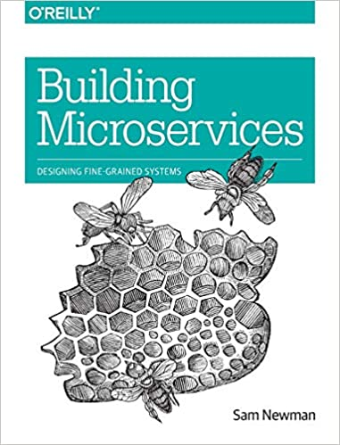</td>
    <td>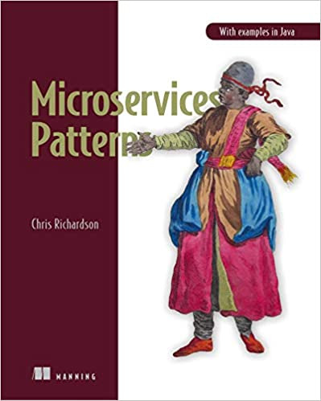</td>
    <td></td>
    <td></td>
	<td></td>
  </tr>
</table>

## Patterns
<table>
  <tr>
    <td></td>
    <td></td>
  </tr>
</table>

## Software Architecture
<table>
  <tr>
    <td></td>
    <td></td>
    <td>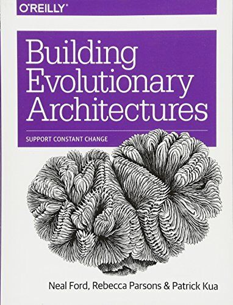</td>
	<td>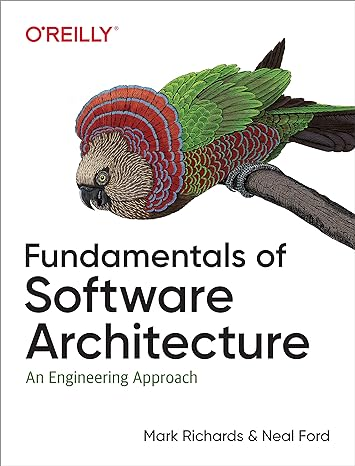</td>
	<td>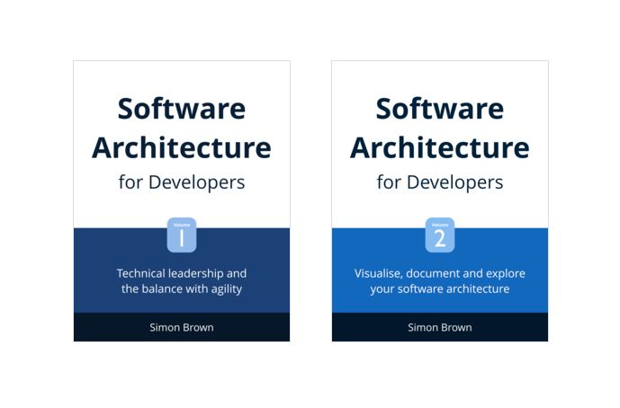</td>
	<td>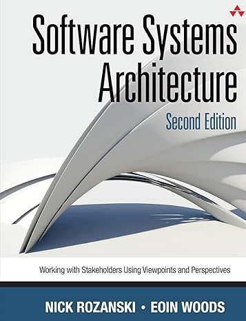</td>
	  <td></td>
    <td>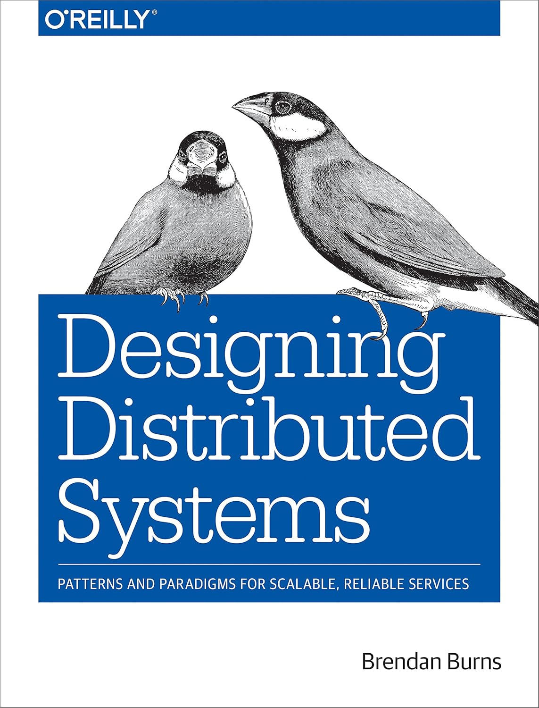</td>
    <td></td>
  </tr>
</table>

## Software/Software Projects/Software Processes
<table>
  <tr>
    <td></td>
    <td>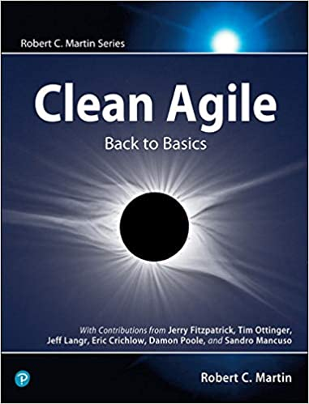</td>
    <td></td>
    <td></td>
    <td></td>
  </tr>
  <tr>
    <td></td>
    <td></td>
    <td></td>
    <td>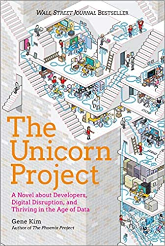</td>
    <td></td>
  </tr>
</table>

## Tests
<table>
  <tr>
    <td>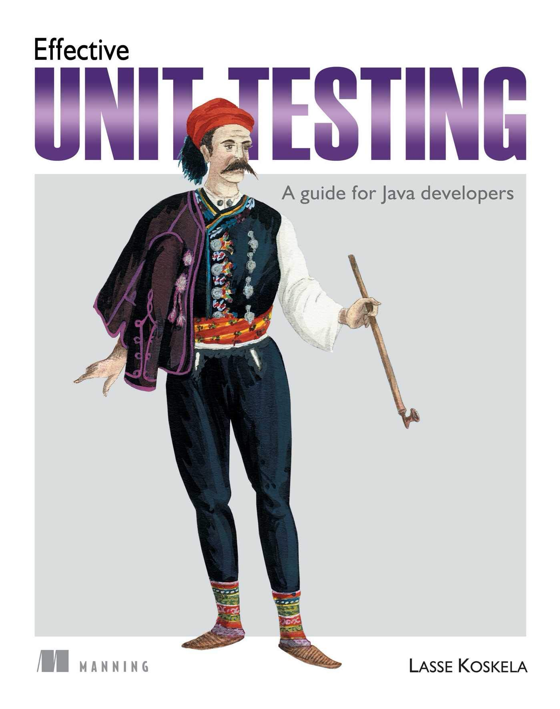</td>
  </tr>
</table>

## TDD - Test-driven Development
<table>
  <tr>
    <td></td>
    <td>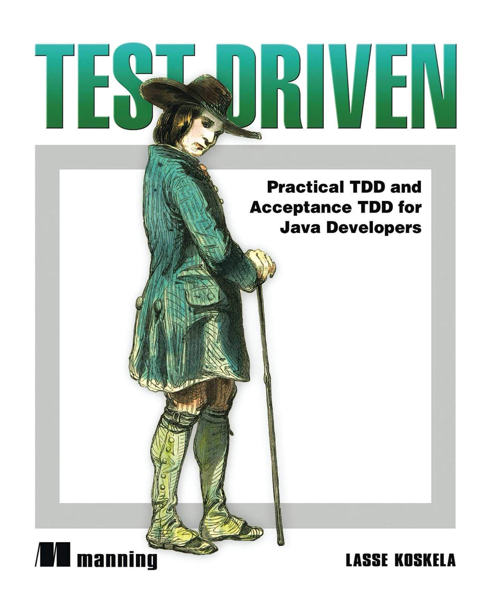</td>
  </tr>
</table>

## Development/Programming
<table>
  <tr>
    <td></td>
    <td></td>
    <td></td>
    <td></td>
    <td></td>
  </tr>
</table>

## SRE - Site Reliability Engineering
<table>
  <tr>
    <td></td>
  </tr>
</table>

## API - Application Programming Interface
<table>
  <tr>
    <td>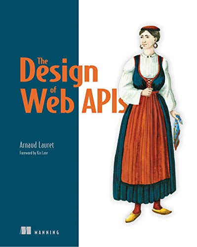</td>
  </tr>
</table>

## Technologies/Frameworks
  
  - ### Kafka
  <table>
    <tr>
      <td></td>
    </tr>
  </table>
  
  
  - ### Redis
  <table>
    <tr>
      <td></td>
    </tr>
  </table>

## DDD - Domain Driven Design
<table>
  <tr>
    <td></td>
    <td></td>
    <td></td>
  </tr>
</table>

## CI - Continuous Integration
<table>
  <tr>
    <td>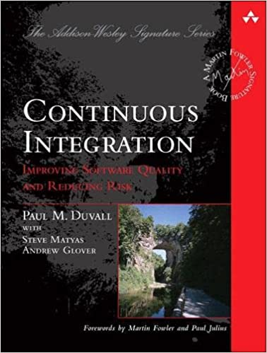</td>
  </tr>
</table>

## CD - Continuous Development
<table>
  <tr>
    <td></td>
  </tr>
</table>

## Algorithms
<table>
  <tr>
    <td></td>
  </tr>
</table>

## Programming Languages
  
  - ### Java
  <table>
    <tr>
      <td>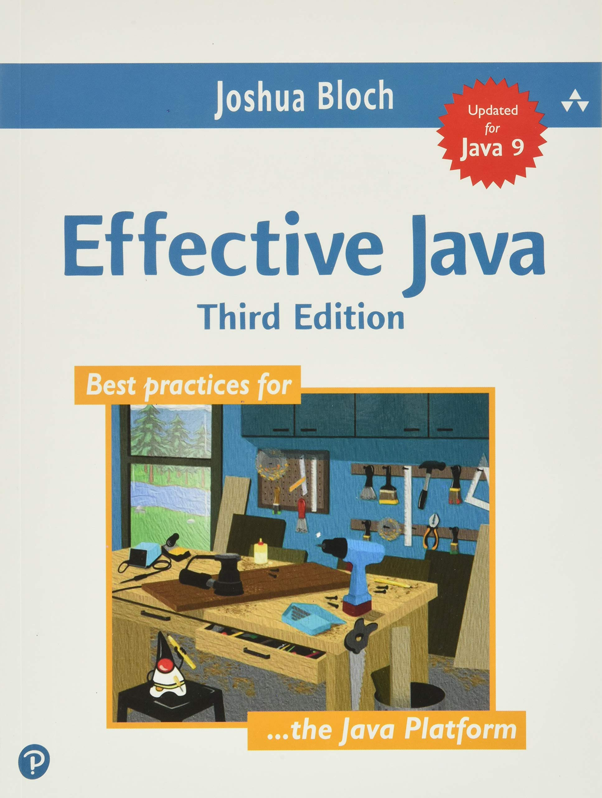</td>
      <td></td>
      <td>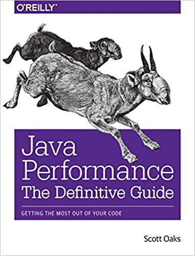</td>
    </tr>
  </table>  
  
  
  - ### Python
  <table>
    <tr>
      <td></td>
    </tr>
  </table>

## Cloud
  <table>
    <tr>
      <td>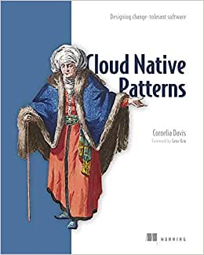</td>
    </tr>
  </table> 
  
  
  - ### CSP - Cloud Service Provider
    
    
    - #### Microsoft Azure
    <table>
      <tr>
        <td></td>
        <td></td>
      </tr>
    </table>   
    
    
    - #### AWS 
    <table>
      <tr>
        <td></td>
      </tr>
    </table>
