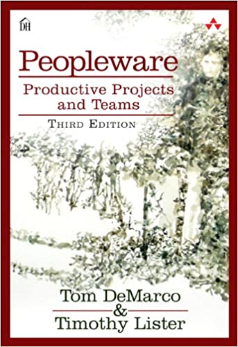
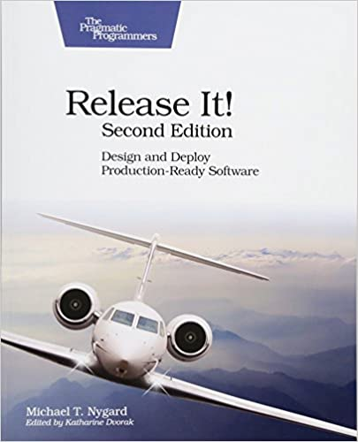

# the-bestselling-books-IT-software-development
The top bestselling books of all time in IT Software Development area such as: Software Engineer, Software Architecture, Software Processes, Project Teams/Organization in Software, Software Development Patterns, Software Architecture Patterns, DevOps, etc. That book list is not exaustive and it can be update by desired people who want to contribute with good book recommendations to read

## Why do We believe sharing and recommending bestsellers books to read is a good idea?
- Sharing with people who work in IT (regardless the level - junior, middle and senior) or with people who are starting their journey in IT area indicating the bestsellers books can help increase their knowledge and expertise in the IT software development.
- When we think about forming new people in IT, It would be a great idea starting with good reads to give fundamentals.
- The senniors people sharing what they know at work is great, but it might no be enough - short time to explain everything. So, we can consider books as a good way to start and help them the base.
- It's a good option to learn with expertises sharing experiences, problems, hard lived situations and why they solve applicating something to solve. Giving a problem and after that some solutions is an opportunity to remember something and use in their jobs.
- The base fundamentals of everything, and reasons why we do something nowadays certainly can be obtained throught good books and you IT student, worker and so on, find and take your own path.

### Topics

1. [ Microservices ](#Microservices)
2. [ Patterns ](#Patterns)
3. [ Software Diverses ](#softwareDiverses)
4. [ Tests ](#tests)
5. [ TDD - Test-driven Development ](#tdd)
6. [ BDD - Behaviour Driven Development ](#bdd)
7. [ Development/Programming ](#developmentProgramming)
8. [ SRE - Site Reliability Engineering ](#sre)
9. [ DevOps](#devOps)
10. [ Technologies/Frameworks ](#technologiesFrameworks)

## Microservices

## Patterns

## Software/Software Projects/Software Processes

## Tests

## TDD - Test-driven Development

## BDD - Behaviour Driven Development

## Development/Programming

## SRE - Site Reliability Engineering

## DevOps

## Technologies/Frameworks
  
  - ### Kafka
  
  - ### Redis
  
  - ### MongoDB

## DDD - Domain Driven Design

## CI - Continuous Integration

## CD - Continuous Development

## Algorithms

## Programming Languages
  
  - ### Java
  
  - ### Python

## Cloud
  
  - ### CSP - Cloud Service Provider
    
    - #### Microsoft Azure
    
    - #### AWS 
